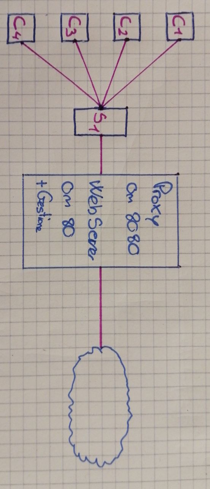

#### Giorno
03.09.2019

### Lavoro svolto
Oggi ho ricevuto il QDC del progetto che andrç ad affrontare nelle prossime settimane.
Ho avuto modo di fare domande al mio comminte chiedendogli direttamente alcuni ounti che non aveo capito. Le domande e il riassunto del QDC sono le seguenti:
>##### Proxy: Squid Proxy
>
>>Memorizza localmente le pagine cosi da ridurre i consumi
>>Controlla anche gli accessi ai siti
>>	
>>Progetto: gestione whitelist
>>
>>Gestione via web di una whitelist basata sugli url
>>		
>>E' necessario implementare anche regex sugli URL es: >*.google.com) 		====>	.google. sintassi dettata da squid. solo > Gestione siti esistenti
>
>##### Ambiente (produzione):
>	
>>	AMPP, NetBeans e XDebug
>>	Installazione server Ubuntu sul quale far girare Squid porta: 8080
>>	
>>	(domanda: é necessario avere una versione specifica o va bene una a mia scelta?)	====> scelgo io
>
>##### Dettaglio applicativo:
>
>>	Che differenze ci sono tra gli amministratori e i gestori lista?			====> amministratore puo creare i gestori, che si loggano
>>	Cosa si intende con autenticazione simulata su windows, su linux >utenti locali?		====> Lasciar via

Inoltre ho realizzato uno schema per far capire meglio ciò che avevo pensato di sviluppare.

Infine ho inziato a realizzare un gantt preventivo

### Errori riscontrati

### Lavor prossima lezione
Continuare e concludere il gantt preventivo.
Iniziare a configurare l'ambiente di lavoro.