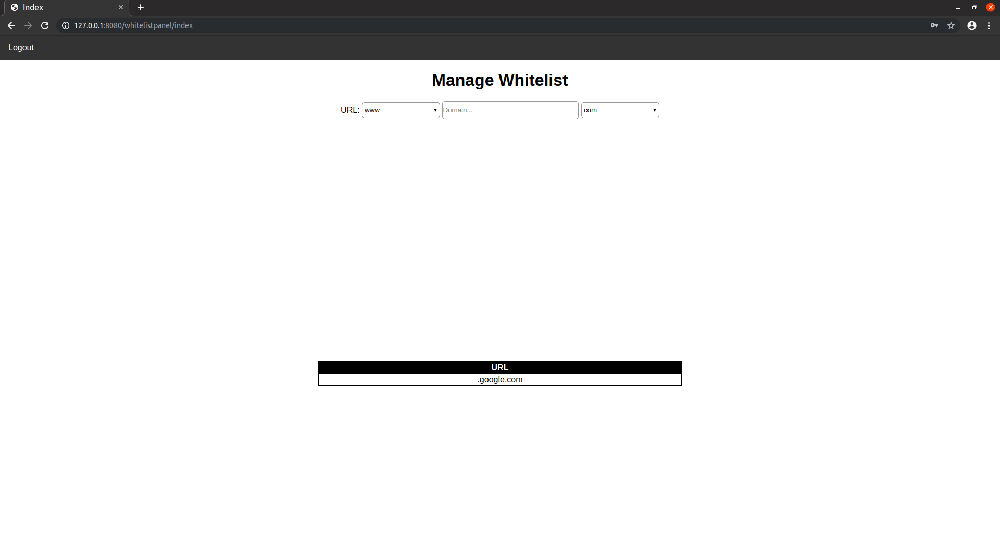

### Info
|Nome progetto|   Nome e Cognome|Data|
|---|---|---|---|---|
|Gestione Whitelist proxy|Carlo Pezzotti|04.10.2019|

### <b>Lavoro svolto</b>
Oggi ho concluso la transazione a MVC ci ho messo parecchio perchè ho voluto essere sicuro che avessi spostato tutto correttamente controllando e ricontrollando i file. Verso fine lezione ho finalmente inziato la parte per la gestione della whitelist.
Nel file di config ho aggiunto una costante `SQUID_WHITELIST` che contiene il percorso dove è presente il file della whitelist. Ho svilupato la grafica di quest'utlima parte e il codice per la realizzazione è il seguente:
```html
<div class="container">
    <div class="container login">
        <form action="<?php echo URL . "whitelist/add" ?>" method="post">
            <span>URL:</span>
            <select name="fstPart">
                <option>www</option>
                <option>web</option>
                <option>docs</option>
                <option>*</option>
                <option>other</option>
            </select>
            <input type="text" name="domain" placeholder="Domain...">
            <select name="endPart">
                <option>com</option>
                <option>ch</option>
                <option>it</option>
                <option>other</option>
            </select>
        </form>
    </div>
</div>
```
La grafica quindi come pensato durante le analisi si presenta nel seguente modo:

La tabella che si vede sul fondo del file è ancora vuota perchè all'interno del file c'è solo il campo `.google.com`.
Infine non mi è ancora venuto in mente come gestire la parte `other` in entrambi select che ci sono.


### <b>Errori riscontrati</b>
Nulla

### <b>Lavor prossima lezione</b>
Continuare con la pagina.