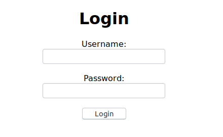

#### <b>Date</b>
05.09.2019

### <b>Lavoro svolto</b>

Oggi ho scaricato un tool per poter generare gantt, il tool si chiama Project della Microsoft. 
Durante la progezione mi sono accorto che secondo i miei calcoli il progetto dovrebbe durare di meno rispetto alle ore assegnateci. C'è la possibilità che io possa aver sbagliato a impostare le durate delle attività.

Inoltre ho scrito in bash uno script che crea in automatico i diari di lavoro, almeno da non sbagliare le date. Come base un un template. Il codice che ho scritto è il seguente


```bash
date=$(date '+%d%m%Y')
name="diario${date}"
mkdir $name
cd $name
cp "../diarioTemplate.md" "${name}.md"
code "${name}.md"
```
Quello che il seguente codice fa non è altro che formattare la data in (ddmmYYYY) aggiungerci il prefisso ("diario") creare la cartella e copiarci dentro il template con il nome generato prima.

Infine oggi ho inziato a pianificare le interfaccie grafiche (pagine), siccome mi sono trovato male con un tool per grafica (GIMP v2.1.0) ho deciso di fare direttamente una bozza di pagina in html e css almeno da facilitare il lavoro seguito poi da un screenshot per riportare il risultato nella cartella aposita dei vari design del sito.
Ho quindi pensato di fare la pagina di login, siccome le specifiche sono che la grafica deve essere minime, nel seguente modo:



### <b>Errori riscontrati</b>
Nessuno

### <b>Lavor prossima lezione</b>
Eventuali correzioni fel gantt.
Iniziare pianificazione del database.
Installare i sistema ubuntu 18.04 server.