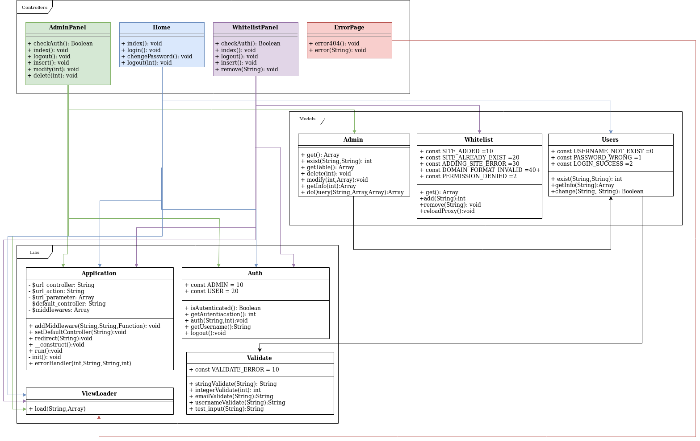

### Info
|Nome progetto|   Nome e Cognome|Data|
|---|---|---|---|---|
|Gestione Whitelist proxy|Carlo Pezzotti|05.11.2019|

### <b>Lavoro svolto</b>
Oggi come citato la scora volta ho commentato il codice il quale ho reputato necessario, ovvero le seguenti classi:
- Controllers
    - AdminPanel
    - WhitelistPanel
    - Home
- Models
    - User
    - Whitelist
    - Admin
- Libs
    - Auth

Inoltre ho iniziato con la stesura della documentazione, in particolare ho realizzato l'UML dell'intero progetto. Siccome quest'utlimo mi ha portato via 2 ore del mio tempo non ho potuto implementarlo nella documentazione.

### <b>Errori riscontrati</b>
Nessuno

### <b>Lavor prossima lezione</b>
Implementare l'UML nella documentazione e spiegare il funzionamento di ogni classe.
Fare scaletta per la demo. 