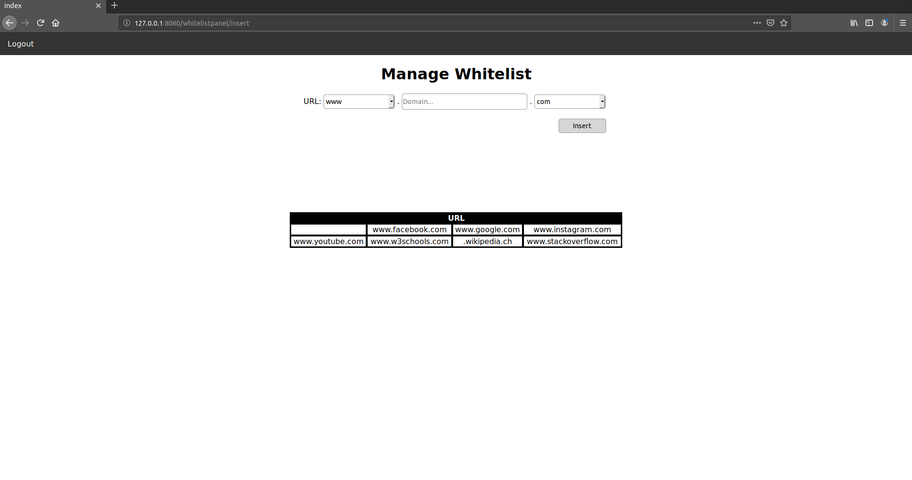

### Info
|Nome progetto|   Nome e Cognome|Data|
|---|---|---|---|---|
|Gestione Whitelist proxy|Carlo Pezzotti|08.10.2019|

### <b>Lavoro svolto</b>
Oggi ho messo a posto i controlli di accesso delle varie pagine. Prima c'èra la possibilità di accedere alle varie pagine anche senza aver fatto il login. Grazie al metodo `Auth::isAuthenticated()` vado a controllare se un utente è loggato oppure no. In caso contrario lo reindirizzo sulla pagina di login come nel seguente esempio:
```php
if (Auth::isAuthenticated()) {
    ViewLoader::load('whitelist/index');
} else {
    ViewLoader::load('home/login');
}
```
Inoltre sono riusto a implimentare il controllo di `Other` nel campo `select`. Per farlo ho utilizzato javascript. Il codice per la realizzazione è il seguente:
```javascript
function ReplaceOther(val,placeholder) {
    if (val.value == 'Other'){             
        var index = Array.prototype.indexOf.call(val.parentElement.childNodes, val)-1;
        var input = document.createElement("input");
        input.name = val.name;
        console.log(val.offsetHeight);
        input.style.width = val.offsetWidth + "px";
        input.style.height = val.offsetHeight + "px";
        input.childNodes = val.childNodes;
        input.setAttribute("placeholder",placeholder);
        val.parentElement.insertBefore(input, val.parentElement.childNodes[index]);
        val.style.display = 'none';
        val.name = "old"+input.name;
    }
}
```
Val: è l'elemento che si andrà a sostituire.
Placeholder: è il placeholder che avrà l'input

Infine ho trovato un modo più o meno elegante per stampare tutti i siti presenti sul file. Il sito ora si presenta nel seguente modo:


Come si vede ci sono 4 colonne per i siti. Nelle prossime lezione ho intenzione di aggiungere la possibilità di filtrare quest'ultimi in modo da cercare in modo più facile se ci sono determinati siti. L'aggiunta al file è univoca, ovvero non ci possono essere 2 siti uguali questa operazione la faccio ogni volta che viene aggiunto un nuovo url nel seguente modo:
```php
public static function add($site)
{
    $files = self::get();
    for ($i=0; $i < \count($files); $i++) { 
        if(\trim($files[$i]) == trim($site)){
            return self::SITE_ALREADY_EXIST;
        }
    }
    $fp = fopen(SQUID_WHITELIST, 'a'); 
    if(!fwrite($fp,$site)){
        return self::ADDING_SITE_ERROR;
    }
    fclose($fp);  
    return self::SITE_ADDED;
}
```

### <b>Errori riscontrati</b>
Nessuno

### <b>Lavor prossima lezione</b>
Aggiungere la possibilità di filtrare i siti. 
Aggiungere la rimozioni di quest'utlimi.