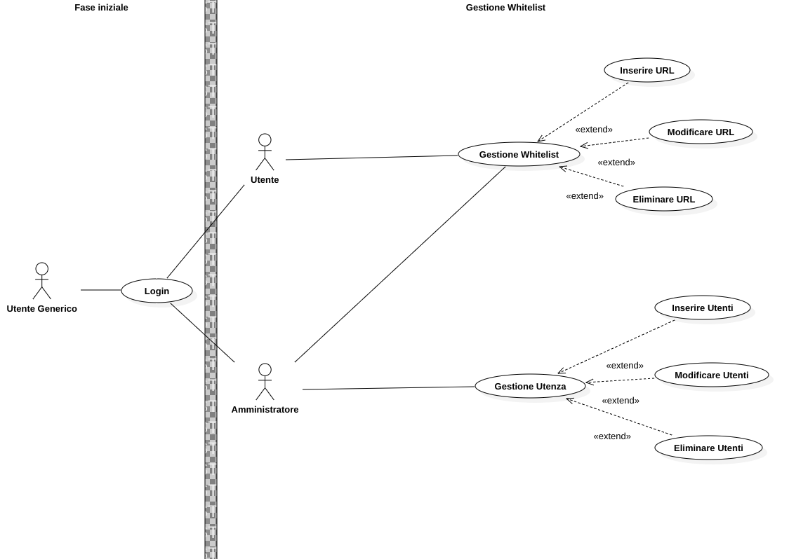

### Info
|Nome progetto|   Nome e Cognome|Data|
|---|---|---|---|---|
|Gestione Whitelist proxy|Carlo Pezzotti| 10.09.2019|

### <b>Lavoro svolto</b>

Oggi ho avuto un colloquio con il mio commitettente e sono uscite le seguenti tematiche:
    
    Aggiungere i requisiti nel prossimo diario
    Modificare a man mano il gannt 
    Gafica semplice.
    Aggiungere in sviluppi futiri la Blacklist

Inoltre ho sviluppato lo use case, il risltato é il seguente:

Durante lo sviluppo mi sono domandato se dovessi anche aggiungere il controllo del'URL nel UseCase, però discutendo con Mathan ho scoperto che forse era meglio non farlo.

### <b>Errori riscontrati</b>

### <b>Lavor prossima lezione</b>