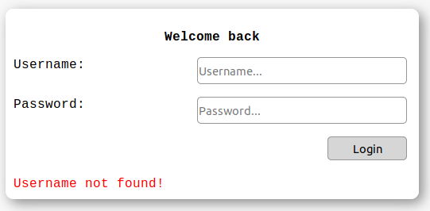

### Info
|Nome progetto|   Nome e Cognome|Data|
|---|---|---|---|---|
|Gestione Whitelist proxy|Carlo Pezzotti| 10.10.2019|

### <b>Lavoro svolto</b>
Oggi ho concluso la pagina per la gestione della whitelist aggiungendo un limite all'alteza della tabella e un input per poter cercare i siti che si vogliono.
Infine ho modificato un po' la grafica globale del sito rendendolo più gradevole alla vista.


Ora tutte le pagine seguono una certa logica.

- Tutti gli elementi dove l'utente deve andare a modificare qualcosa sono all'interno di un contenitore con i bordi rotondi e in rilievo.
- Gli altri elementi sono privi di rilievo.

<br>

Ora ogni notifica viene mostrata in basso a sinistra nei seguenti colori:

- Rosso: se qualcosa è andato male.
- Giallo: se c'è un warning da comunicare.
- Verde: se è andato a buon fine qualcosa.

La pagina di gestione della whitelit ora si presenta nel seguente modo:
<br>
La tabella contenente tutti i siti a una certa diventa scrollabile, così che all'utente risulta migliore la legibilità. 
Sopra la tabella vi è un input di ricerca all'interno della tabella che la va a filtrare in modo automatico quando si preme e rilascia un tasto della tastiera. Il codice per la relizzazione del segente filtro l'ho strutturato così:

```javascript
function searchInTable(value) {
    var filter = value.toLowerCase();
    var rows = document.querySelector("#table tbody").rows;
    for (var i = 0; i < rows.length; i++) {
        for (var j = 0; j < rows[i].cells.length; j++) {
            var col = rows[i].cells[j].textContent.toLowerCase();;
            if (col.indexOf(filter) > -1) {
                rows[i].cells[j].style.display = "";
            } else {
                rows[i].cells[j].style.display = "none";
            }
        }
    }
}
```


### <b>Errori riscontrati</b>
Verso fine lezione ho provato ad rimuovere tutti i siti dal file er verificare come fosse la tabella vuota. Una volta che dal sito ho riprovato ad aggiungere un sito la pagina mi tirava un eccezione di permission denied. Purtroppo non sono riuscito a risolverlo in tempo oggi.

Un altro errore nella quale mi sono scontrato è che se con un account normal provo ad accere al pannello admin me lo lascia fare. Non ho avto tempo di fixare il seguente errore.

### <b>Lavor prossima lezione</b>
Mettere a posto tutti gli errori descritti in precedenza. 
Verificare la sicurezza del codice (aggiungere una classe `validate` che faccia il lavoro di validare tutti i dati che si inseriscono nel database).
Pagina per la gestione degli errori, come Permission Denied, File not exist,..
Se rimane tempo, implementare tutto il sito sul server per verificare il corretto funzionamento.
