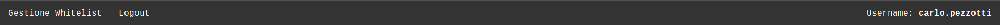

### Info
|Nome progetto|   Nome e Cognome|Data|
|---|---|---|---|---|
|Gestione Whitelist proxy|Carlo Pezzotti|11.10.2019|

### <b>Lavoro svolto</b>
Oggi per le prime di ore di lezione il docente Valsangiacomo ci ha spiegato come funzionasse l'esame che dovremmo fare in futuro. Durante le altre 2 invece siamo stai interrotti per un altro quarto d'ora per la spiegazione della della presentazione.
Nel tempo rimanente non sono riusciuto a fare tutto quello che mi ero fisto di fare siccome non ho avuto il tempo materiale. 
Sono però riuscito a fre la parte più importante ovvero la sicurezza dietro ad ogni pagina. Ho modifcato la classe che utilizavo per la gesitone delle sessioni ed ho aggiunto i seguenti metodi:

```php
const ADMIN = 10;
const USER = 20;

public static function isAutenticated()
{
    return isset($_SESSION["auth"]);
}

public static function getAutentication()
{
    if (isset($_SESSION["auth"])) {
        return $_SESSION["auth"];
    }
    return false;
}

public static function auth($username, $type)
{
    $_SESSION["username"] = $username;
    $_SESSION["auth"] = $type;
}

public static function getUsername()
{
    if (isset($_SESSION["username"])) {
        return $_SESSION["username"];
    }
    return false;
}

public static function logout()
{
    foreach ($_SESSION as $key => $value) {
        unset($_SESSION[$key]);
    }
    session_destroy();
}
``` 
Nel seguente modo ogni quando setto la sessione di autentiazione aggiungo pure di che tipo è l'utente che si è loggato. Ho pensto che a livello grafico sarebbe stato bella se in altro a destra uscisse l'username della persona connessa.
Ora la navbar appare nel seguente modo:


I controllers che necessiato che ci sia una controllo hanno la seguente funzione:
```php
private function checkAuth()
{
    if (Auth::isAutenticated()) {
        if (Auth::getAutentication() == Auth::ADMIN) {
            return true;
        } else {
            Application::redirect('whitelistpanel/index');
        }
    } else {
        Application::redirect("home/login");
    }
}
```
Viene modificata in base alle necessità.

### <b>Errori riscontrati</b>

### <b>Lavor prossima lezione</b>
Mettere a posto i bug.
Fare le cose che mi ero fissato per oggi.