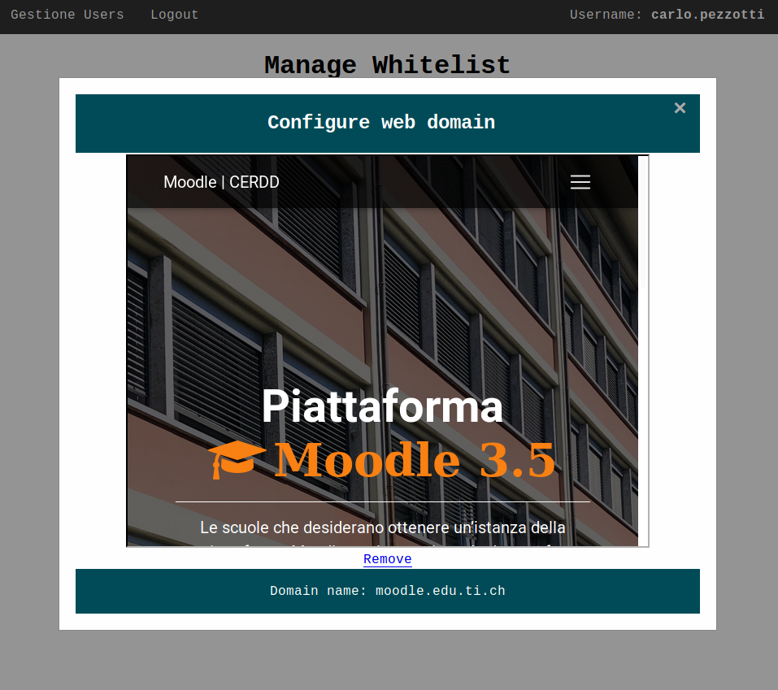

### Info
|Nome progetto|   Nome e Cognome|Data|
|---|---|---|---|---|
|Gestione Whitelist proxy|Carlo Pezzotti|17.10.2019|

### <b>Lavoro svolto</b>
Come segnalato nel diario scorso oggi ho lavoro principalemente sulla grafica. Andando a rigudare il file css ho trovato molto codice inutile non rimosso nel tempo. La struttura del sito non è stata modificata ma la grafica si:
- Shadow rimosse
- Rimossi margin e padding inutili
- Attributi inutili rimossi
- Border tabella rimossi

Mentre modificavo la grafica mi è sorto un dubbio, ovvero i siti resenti nella pagina della gestione della whitelist non erano rimuovibili. Ho pensato a lungo ad un modo carino per poter rimuovere i siti. 

```javascript
function showModal(site) {
    site = site.innerHTML;
    document.getElementById("myModal").style.display = "block";
    document.getElementById("domainName").innerHTML = "Domain name: " + site;
    var iframe = document.getElementById("iframeDomain");
    iframe.setAttribute("src", "https://" + site);
    iframe.style.width = "640px";
    iframe.style.height = "480px";
    var href = document.getElementById("removeDomain");
    href.setAttribute("href",href.getAttribute("href")+window.btoa(site));

}
```

Codice per utilizzato per mostrare il modal personalizzato.

```php
public static function remove($site){
    $sites = self::get();
    for ($i=0; $i < \count($sites); $i++) { 
        if(trim($sites[$i]) == trim($site)){
            unset($sites[$i]);
            break;
        }
    }
    self::clearFile();
    for ($i=0; $i < count($sites); $i++) { 
        self::add($sites[$i]);
    }   
}
```
Codice utilizzato per andare a rimuovere un sito dal file.




Nella pagina di login ho utilizzato un modal per gestire il cambio della password. Ho pensato quindi che anche in questo caso sarebbe stato carino se lo avessi usato. Come si vede nell'immagina qui sopra quando si clicca su un sito viene aperto un modal che mostra la pagina web e da la possibilità all'utente di andare a rimuovere il sito.

### <b>Errori riscontrati</b>
Purtroppo non sono riuscito a testare ancora il prodotto sulla macchina server per via del tempo.

### <b>Lavor prossima lezione</b>
Testare il prodotto sul server e iniziare il capitolo di implementazione della doc.