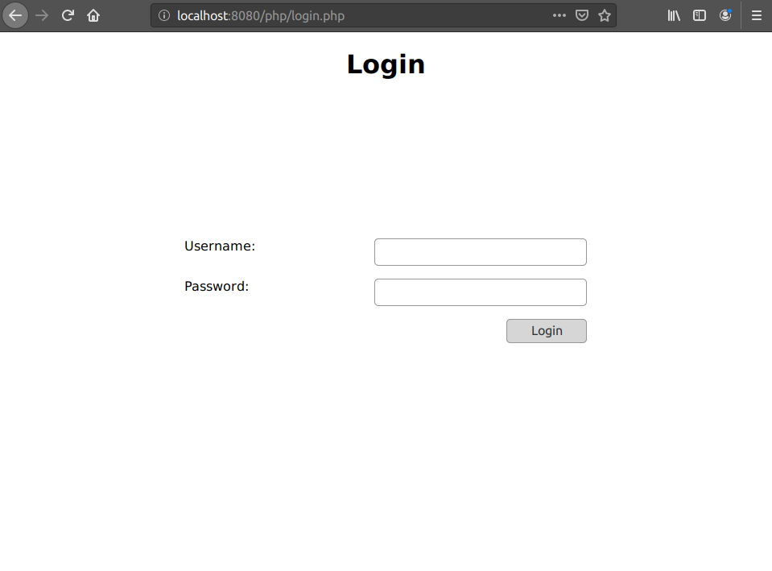

### Info
|Nome progetto|   Nome e Cognome|Data|
|---|---|---|---|---|
|Gestione Whitelist proxy|Carlo Pezzotti|19.09.2019 |

### <b>Lavoro svolto</b>
Oggi ho iniziato la pagina di login e ho modificato la classe di database modificando delle dimenticanze. Ho avuto un problema per quasi la durata di 3 ore. Non riuscivo a far connettere il client `database.php` al database su ubuntu server. Per risolvere il problema ho provato a disinstallare il servizio maria-db e l'ho rimpiazzato con mysql-server. 
Alla fine ho dovuto cambiare porta perchè, controllando il file di log `/var/log/mysql/error.log`, ho scoperto che il servizio non riusciva ad avviarsi.

Il codice per la pagina di login è il seguente:
```html
<div class="container">
    
    <div class="container login">
        <form action="login.php" method="post">               
            <div class="loginC">
                <span>Username:</span>
                <input type="text" name="username">
            </div>
            
            <div class="loginC">
                <span>Password:</span>
                <input type="password" name="password">
            </div>   
            <div class="loginC"> 
                <input type="submit" value="Login"> 
            </div>
        </form>
    </div>
</div>
```
E si presenta nel seguente modo:



### <b>Errori riscontrati</b>
Descritto in precendenza.

### <b>Lavor prossima lezione</b>
Autenticazione con il database.
