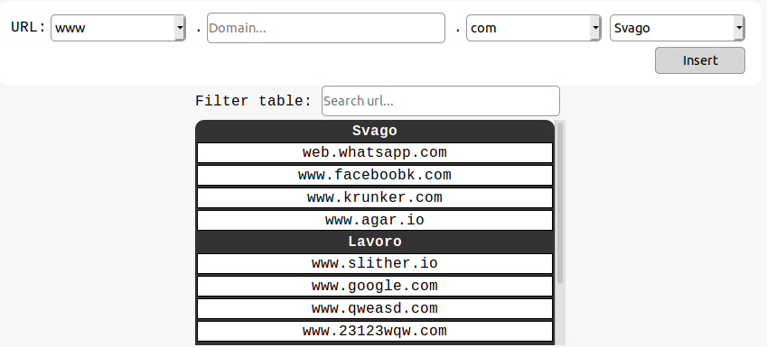

### Info
|Nome progetto|   Nome e Cognome|Data|
|---|---|---|---|---|
|Gestione Whitelist proxy|Carlo Pezzotti|21.11.2019|

### <b>Lavoro svolto</b>
Siccome la volta scorsa ho discusso con il comminete a riguardo di cose che potrei aggiunngere al sito per rendere più comodo l'utlizzo del prodotto. Oggi ho lavorato alla pagina della gestione della whitelist implementando le categorie dei siti. Per far ciò inizialemente ho pensato fosse meglio se gestissi tutto direttamente su un database.
Poi però riflettendoci un attimo di più sono giunto alla conclusione che sarebbe stato meglio gestire il tutto direttamente sul file di configurazione. Per far ciò ho utilizzato i commenti.
Ora il file ha la segunte formttazione:
> #Svago;Lavoro;Altro
>#Svago
>web.whatsapp.com
>www.faceboobk.com
>www.krunker.com
>www.agar.io
>#Lavoro
>www.wikipedia.io
>.google.com
>#Altro
>www.qweqywrtywereqwr.com
>www.qeqjdygqi76e2r.com
> ...

La prima riga contiene tutte le categorie che si potranno riscontrare all'interno del file. Per come l'ho pensata questa riga verrà modificata solo dagli amministratori. Oggi ho realizzato il codice per andare a leggere il file e gestirlo grazie agli oggetti di PHP, il codice per la realizzazione è il seguente:

``` php
$file = file(SQUID_WHITELIST);
$categories = Whitelist::getCategories();
$obj =  (object) array();
$current = "";
for ($i=1; $i<\count($file) ; $i++) { 
    $line = trim(\substr($file[$i],1,strlen($file[$i])));
    for ($j=0; $j < \count($categories); $j++) { 
        if($line == trim($categories[$j])){
            $current = trim($categories[$j]);
            $obj->$current = array();
        }
    } 
    if($file[$i]{0} != "#"){
        array_push($obj->$current,trim($file[$i])); 
    }
}
```
La variabile $obj è struttara come se fosse un json, l'ho fatto in questo modo, almeno se in un futuro bisognasse utilizzare dei json il codice è già pronto.
Il risultato della pagina ora è il seguente:

Ho aggiunto un campo di tipo select per poter aggiungere una categoria al sito
La tabella ora è suddivisa per categorie.

### <b>Errori riscontrati</b>
Nessuno

### <b>Lavor prossima lezione</b>
Continuare con la gestione dei siti. Aggiungere più filtri.