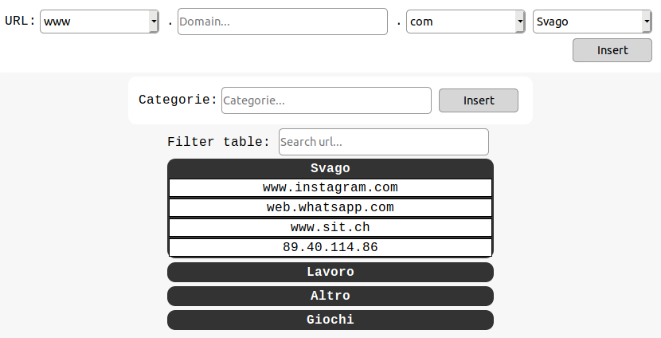

### Info
|Nome progetto|   Nome e Cognome|Data|
|---|---|---|---|---|
|Gestione Whitelist proxy|Carlo Pezzotti|22.19.2019|

### <b>Lavoro svolto</b>
Oggi ho continuato con la modifica della pagina di gestione della whitelist. Ho implementato quasi a pieno la divisione dei siti per categorie. La pagina ora si presenta nel seguente modo:

Tutti i siti, come detto in precedenza, ora sono divisi per categoria. Cliccando sul nome della categoria si apre la tabella che mostra tutti i siti che contiene.
Per come l'ho pensata io, solo gli amministratori possono aggiungere o rimuovere delle categorie. La sezione di aggiunta delle categorie è visibile solo agli amministratori quindi.

Il codice per l'aggiunta  di una categoria è il seguente:

```php
$categories = Whitelist::getCategories();
$insert = true;
for ($i = 0; $i < \count($categories); $i++) {
    if (trim(strtolower($categories[$i])) == trim(strtolower($categorie))) {
        $insert = false;
        break;
    }
}
echo $insert;

if ($insert){
    \file_put_contents(SQUID_WHITELIST, "#" . $categorie, FILE_APPEND);  
    $file = \file(SQUID_WHITELIST);
    $firstLine = trim($file[0]);
    $firstLine.=";$categorie\r\n";
    $file[0] = $firstLine;
    $fp = fopen(SQUID_WHITELIST, 'w');
    for ($i = 0; $i < \count($file); $i++) {
        fwrite($fp, trim($file[$i]) . "\r\n");
    }
}
```

### <b>Errori riscontrati</b>
Nulla

### <b>Lavor prossima lezione</b>
Aggiungere la possibilità di rimuovere le categorie e i siti.