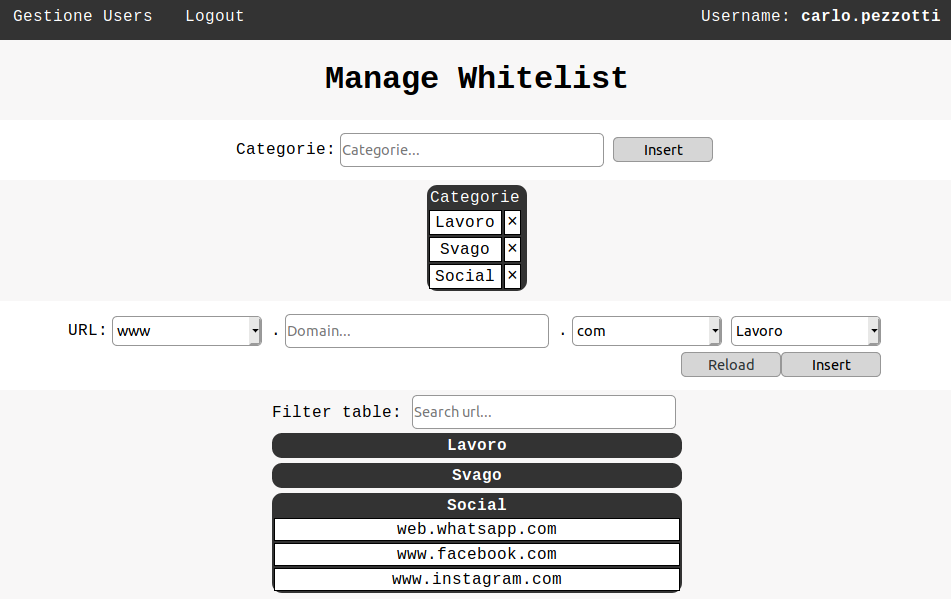

### Info
|Nome progetto|   Nome e Cognome|Data|
|---|---|---|---|---|
|Gestione Whitelist proxy|Carlo Pezzotti|26.11.2019|

### <b>Lavoro svolto</b>
Oggi ho continutato con l'implementazione delle categorie nella whitelist. In particolare ho lavorato a rigurado dell'eliminazione delle categorie. Ora qunado una tagegoria viene eliminata tutti i siti che ne fanno parte vengono eliminati di seguito. Inoltre negli ultimi minuti di lezinoe ho modificato il css della pagina. Ora la pagina, con anche gli aggiornamenti di stile, si presenta nel seguente modo:

Da come si può notare nell'imagine non ho ancora implementato la possibilità di rimuore i siti dalla whitelist. È il lavoro che farò la prossima lezione.
Il codice per l'eliminazione è il seguente:

```php
public static function deleteCategoria($categoria)
{
    $delete = true;
    $file = file(SQUID_WHITELIST);
    $file[0] = str_replace("#".$categoria.";", "#", $file[0]);
    $file[0] = str_replace(";".$categoria, "", $file[0]);
    $file[0] = str_replace($categoria, "", $file[0]);
    for ($i = 1; $i < \count($file); $i++) {
        if ($file[$i]{
        0} == "#") {
            $subString = \substr($file[$i], 1, \strlen($file[$i]));
            if (strtolower(trim($subString)) == strtolower(trim($categoria))) {
                array_splice($file, $i, 1);
                while ($delete) {
                    if (isset($file[$i]) && $file[$i]{0} != "#") {
                        array_splice($file,$i,1);
                    } else {
                        file_put_contents(SQUID_WHITELIST, implode($file));
                        $delete = false;
                    }
                }
                break;
            }
        }
    }
}
```

### <b>Errori riscontrati</b>
Nulla.

### <b>Lavor prossima lezione</b>
Implementare la possibilità di rimuovere siti dalla whitelist.